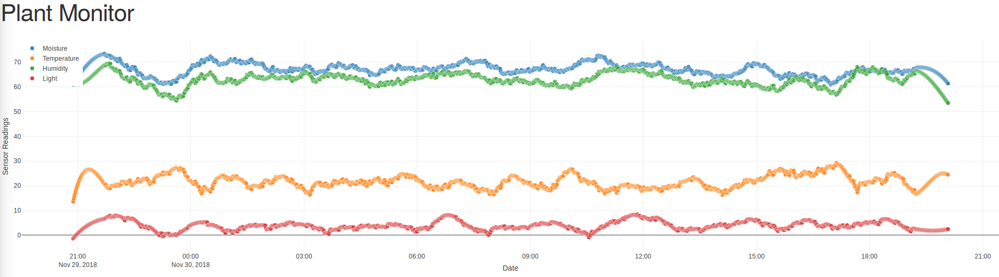

# PlantMonitor
Monitoring my plant with various sensors

Soil levels: 
Completely dry: 0 
Completely saturated: ~880 

Light levels: 
Dark: 0 
Highest value: 1023 

Log file format: 
`temperature,humidity,light,moisture,date`
